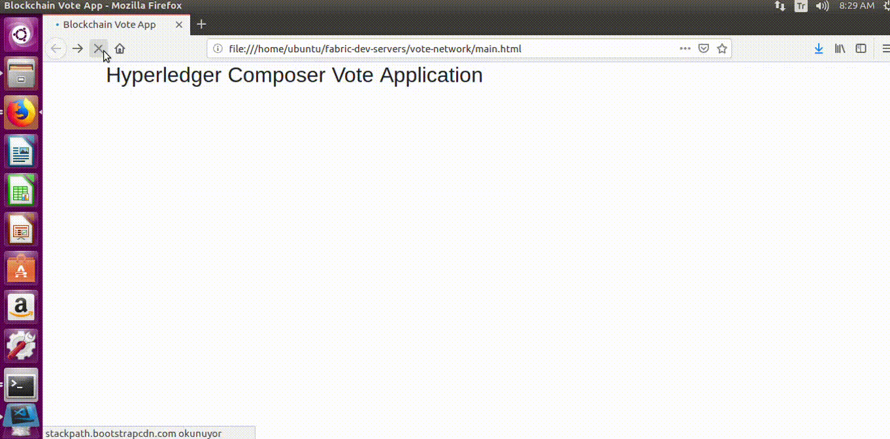
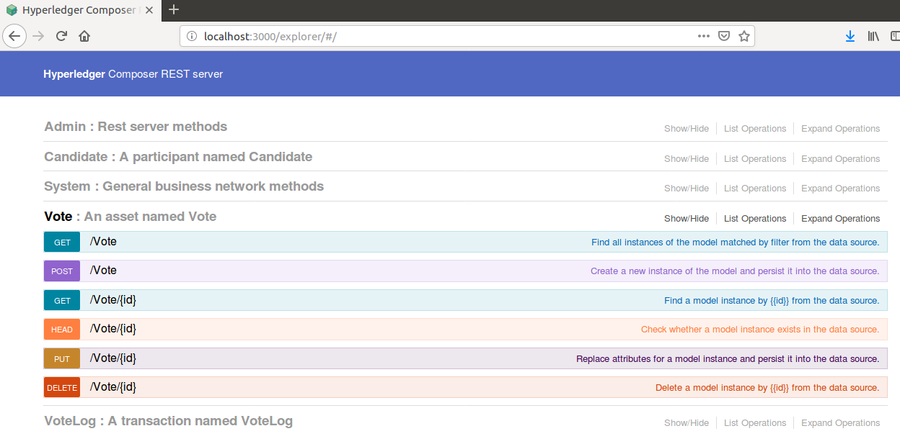
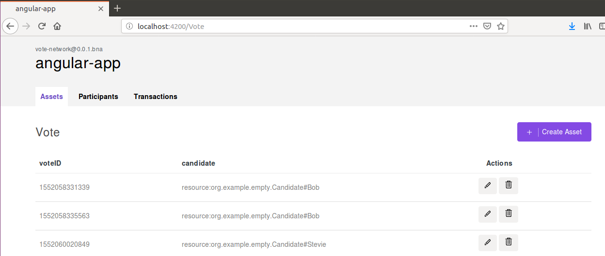

# Blockchain Based Vote Application On Hyperledger Composer
This is basic Vote Application that used Hyperledger Composer as Blockchain environment. The result is shown whenever any candidate
is selected as vote. Candidates select their vote from a web application that used Hyperledger Composer's Rest API. Our work runs on
Ubuntu.



## Getting Started
Hyperledger Composer is an extensive, open development toolset and framework to make developing blockchain applications easier. Composer
supports existing Hyperledger Fabric blockchain infrastructure and creating blockchain environment becomes easy with Composer. We
just focus Model, Script and Access Control files that generate our Business Network Archive(.bna). Business Network Archive file is
ready to deploy on distributed ledger that exists Hyperledger Fabric and Node.js. After that we just develop a web interface that used
this Rest API with which language we want.
- Model File(.cto) : It contains Assets, Participants and Transactions definitions.
```
namespace org.example.empty

asset Vote identified by voteID {
    o String voteID
    --> Candidate candidate
}

participant Candidate identified by candidateId {
    o String candidateId
    o String firstName
    o String lastName
}

transaction VoteLog {
    o String voteID
    --> Candidate candidate
}
```
- Script File(.js) : It contains transaction's function that is executed when a transaction comes.
```
/**
 * @param {org.example.empty.VoteLog} tx
 * @transaction
 */
async function logAdd(tx) {
    let assetRegistry = await getAssetRegistry('org.example.empty.Vote');
  	var factory = getFactory()
    var asset = factory.newResource('org.example.empty', 'Vote', tx.voteID)
    asset.candidate = tx.candidate
    await assetRegistry.add(asset);
}
```
- Access Control File(.acl)

**Prerequisites**

For the Hyperledger Composer, we need to install following; `Docker Engine`, `Docker-Compose`, `Node`, `npm`, `git`, `Python` and
`VSCode`(It is not necessary, but useful). From [here](https://hyperledger.github.io/composer/v0.19/installing/installing-prereqs.html), you can
find how to install pre-requisites above.

**Installing**

If we sure that our pre-requisites are installed, we will continue with installing development environment we will use. This means that
we get Hyperledger Composer development tools(Essential CLI tools, Composer rest server for Rest API) and awake up Hyperledger Fabric 
from [here](https://hyperledger.github.io/composer/v0.19/installing/development-tools.html).

In this application, we use Hyperledger Composer's Rest API. Therefore we need to some installation and configuration to awake Rest API
on localhost:3000 port according to Business Model we create that placed above. There is a picture that shows what the endpoints
look like below;



Also, Hyperledger Compose presents 2 opportunities to developing environment;
- One of them is online playground environment. We can also set up and manage our business network, assets, participants and
transactions on browser. From [here](https://hyperledger.github.io/composer/v0.19/tutorials/playground-tutorial.html), you can find a
tutorial to how to use playground environment.
- Second of them is Angular 4 application against the Rest API. Hyperledger Composer presents existing web application on 4200 port like
application we've done in this application. From [here](https://hyperledger.github.io/composer/v0.19/tutorials/developer-tutorial.html),
you can seem how to awake it and sample picture places below;


